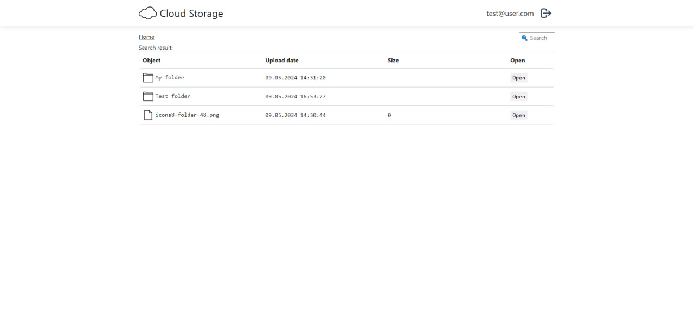

# Cloud storage app
http://13.60.91.96:8080/
## Функционал приложения

### Работа с пользователями:
- Регистрация
- Авторизация
- Logout
### Работа с файлами и папками:
- Загрузка файлов и папок
- Создание новой пустой папки (аналогично созданию новой папки в проводнике)
- Удаление
- Переименование

## Инструменты

- .NET 8.0
- ASP.NET Core MVC
- PostgreSQL
- Dapper
- Docker
- Redis
- AWS S3 (File storage)

## Переменные окружения
| Наименование   | Стандартное значение    | Описание                    |
|----------------|-------------------------|-----------------------------|
| POSTGRES_PORT  | `5432`                  | порт постгрес               |
| POSTGRES_DB    | `cloudfilestorage`    | название базы данных постгрес |
| POSTGRES_USER  | `postgres`              | наименование пользователя постгрес |
| POSTGRES_PASSWORD | `postgres`              | пароль пользователя постгрес |
| REDIS_PORT     | `6379`                  | порт редис                  |
| AWS_PROFILE |                         | профиль AWS                 |
| AWS_ACCESS_KEY_ID |                         | ключ подключения к AWS S3   |
| AWS_SECRET_ACCESS_KEY |            | 	секретный ключ базы        |
| AWS_REGION  | `us-east-1`                  | регион AWS                  |
| SERVER_PORT    | `8080`                  | Порт приложения             |

## Интерфейс приложения

### Login page

### Home page

### File page

### Search page

